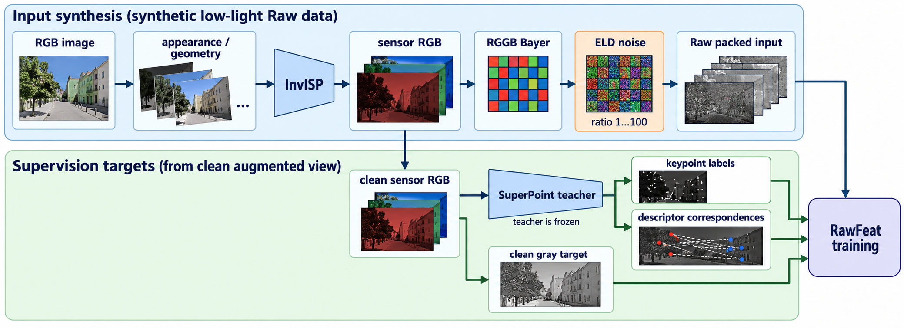
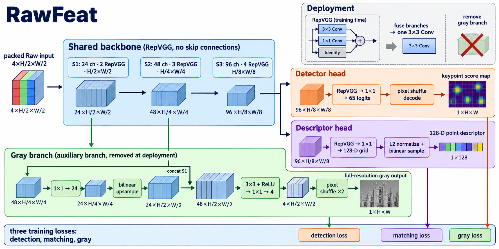
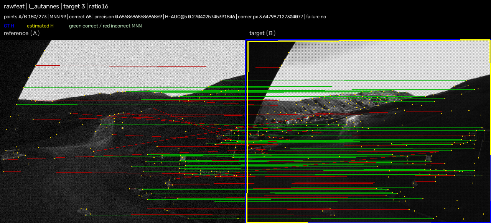
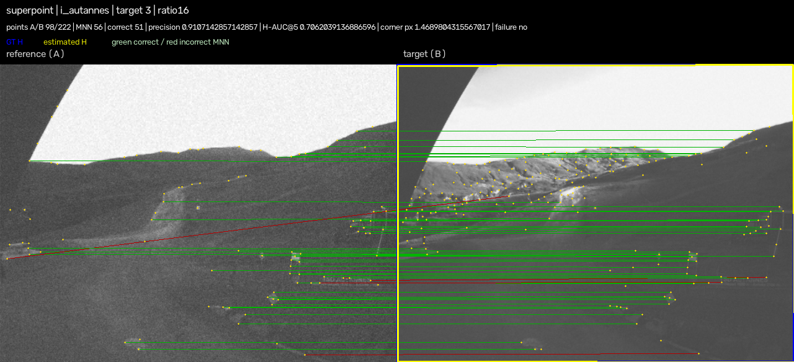
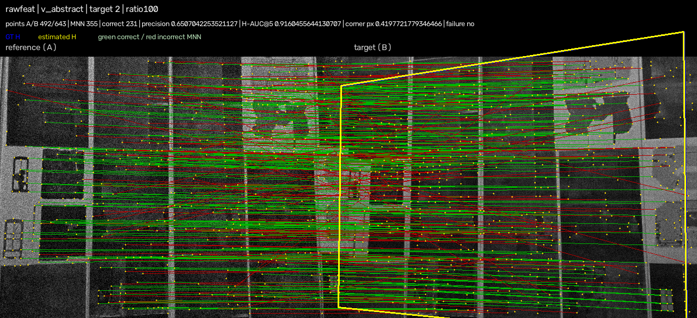
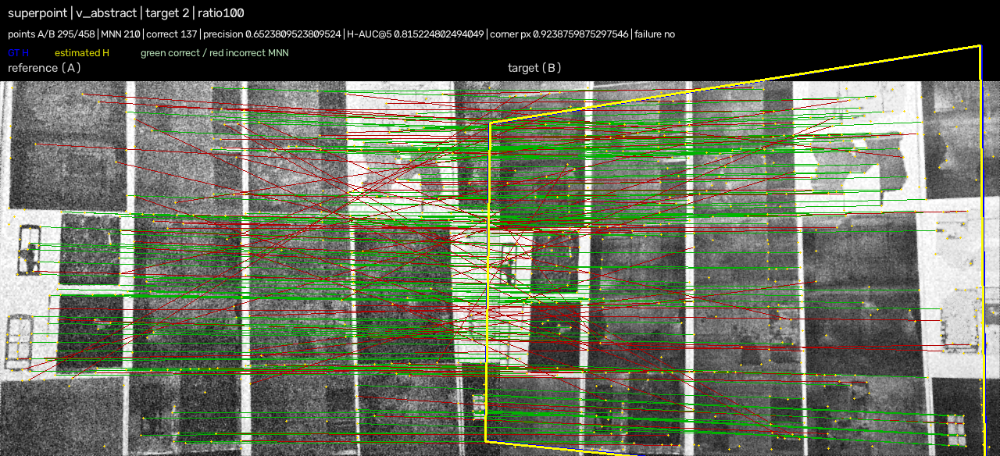

# RawFeat：低照度 Raw 特征提取器

RawFeat 从低照度相机的四通道 Bayer Raw 数据中，同时输出关键点和 128 维描述子。它面向这样的场景：图像很暗、噪声很强，但后续任务仍需要稳定的匹配和几何估计。

训练时增加一个灰度恢复分支，让共享骨干先学会一部分降噪；部署时融合 RepVGG 多分支并删除灰度分支，所以推理只保留检测和描述子两条路径。

当前版本是 **v1**。首版正式训练使用 100000 次更新，首选权重为 [step 96000](weights/v1/checkpoint_step_096000.pt)。在固定 COCO Raw 验证协议上，RawFeat 的五档含噪 H-AUC@5 为 **68.0846%**，MeanAD+SuperPoint 为 **65.6030%**。完整训练曲线、逐对结果和训练身份见 [v1 权重说明](weights/v1/README.md) 与 [训练分析](docs/formal_training_analysis_20261007.md)。

## 0. 项目做什么

整个系统把一张普通 RGB 图像转换成带相机噪声的 Raw Bayer 输入，再训练 RawFeat 学习三件事：

1. 哪些像素附近像关键点，以及关键点在一个 8×8 cell 中的精确位置；
2. 同一个场景在两张图中的局部描述子应该相似；
3. 共享特征中的低层信息应该能够恢复干净灰度。

当前算法、训练边界和数值域以 [唯一设计文档](docs/low_light_raw_feature_extractor_design.md) 为准。历史实验只作为证据，不是可切换的第二套算法。

## 1. 数据如何合成

### 1.1 从普通 RGB 到合成 Raw

训练使用 COCO train2017 图像。每次取一张图，缩放并裁成 480×640，然后生成两张视角：

- 两个视角分别做亮度、对比度、Gamma、饱和度、阴影或模糊等外观变化；
- 再对其中一张施加随机仿射和轻微透视变化，保存两视角之间的单应矩阵；
- 同一份增强后的 RGB 先经过冻结的 Canon InvISP，得到连续的三通道 sensor RGB；
- 先对连续 sensor RGB 做几何变换，再采样 RGGB Bayer，不能直接对已经采样的马赛克做几何变换；
- 使用 Canon EOS 5D Mark IV 的 ELD 标定加入散粒噪声、Tukey 读出噪声、行噪声和量化噪声；
- 最后减黑电平、按白电平归一化、应用固定白平衡，按 `[R, G1, G2, B]` 打包成 4×240×320 输入。

噪声使用完整的相机 DN 物理域。黑电平为 2048，白电平为 16383，噪声模型可概括为：

\[
x_{noisy}=r\left[\frac{x_{clean}}{r}+n_{ELD}\left(\frac{x_{clean}}{r}\right)\right].
\]

这里的 `r` 是曝光比。每个视角独立采样噪声；训练课程从 `r=1` 开始，逐渐扩展到 `r=100`。`r=1` 仍然有 ELD 噪声，并不等于干净图。

### 1.2 标签从哪里来

标签全部来自同一张图的干净版本，因此不需要人工逐点标注。

**关键点标签。** 冻结官方 MagicLeap SuperPoint，在增强后的干净灰度图上运行。它在每个 8×8 cell 输出 65 类概率：前 64 类表示 cell 内的 64 个像素位置，最后一类是 dustbin（表示该 cell 没有关键点）。RawFeat 学习这个完整分布，而不是只学习一个二值角点图。

**描述子对应标签。** 从教师的关键点中取约 75%，再加入约 25% 的空间均匀点。用已知单应矩阵把两视角中的点对应起来，最多保留 512 对，并过滤出界、无效区域和过近点。这样描述子学习的是明确的几何对应，不依赖学生当前是否已经检测出了这个点。

**clean gray 标签。** 在 Bayer 采样之前，从干净 sensor RGB 减黑电平、归一化并应用同一白平衡，再按 `0.299R+0.587G+0.114B` 得到全分辨率灰度目标。这个目标保留外观变化，只约束传感器域的恢复能力。



图 1：从 RGB、InvISP、Bayer、ELD 噪声到 RawFeat 输入，同时生成关键点、描述子对应和 clean gray 三类监督。

## 2. 网络结构

输入是四通道打包 Bayer，网络不需要先把 Raw 还原成普通 RGB。共享骨干和三个输出分支如下：

| 模块 | 输出尺寸（相对原图） | 通道/输出 | 作用 |
|---|---:|---:|---|
| 输入 | H/2 × W/2 | 4 | `[R,G1,G2,B]` 打包 Raw |
| S1 | H/2 × W/2 | 24，2 个 RepVGG block | 保留低层纹理和噪声信息 |
| S2 | H/4 × W/4 | 48，3 个 RepVGG block | 下采样并扩大感受野 |
| S3 | H/8 × W/8 | 96，4 个 RepVGG block | 提供检测和描述子所需的高层特征 |
| 检测头 | H/8 × W/8 | 65 logits | 64 个 cell 内位置 + dustbin |
| 描述子头 | H/8 × W/8 | 128 通道 | 生成 128 维描述子网格 |
| gray 头 | H × W | 1 通道 | 训练时的降噪辅助输出 |

每个 RepVGG block 在训练时是 `3×3 Conv+BN`、`1×1 Conv+BN` 和可用的 `Identity+BN` 相加后接 ReLU。部署时用 BN 统计量把这些分支代数融合成一个带偏置的 3×3 卷积，输出数值保持一致。

检测头的 65 类 logits 通过 pixel shuffle 还原为全分辨率 score map，再做阈值、NMS、边界过滤和最多 1024 点的选点。描述子头输出 128 通道网格，先做 L2 归一化，再在关键点坐标处双线性采样。

gray 分支从 S2 用 1×1 卷积降到 24 通道，上采样到 S1 的尺寸，与 S1 拼接后经过 `3×3 + ReLU` 和 `1×1` 得到 4 个半分辨率通道，最后 pixel shuffle×2 得到全分辨率灰度。它直接给 S1/S2 梯度，S3 不接收 gray 的梯度；部署导出时整个分支被删除。



图 2：共享骨干、检测头、描述子头和训练期 gray 分支；右上角显示 RepVGG 融合与 gray 删除。

## 3. Loss 函数

总损失只有三部分：检测、匹配和 gray。冻结的 SuperPoint 只提供目标，梯度不会回到教师。

### 3.1 检测损失：先学“有没有”，再学“在哪里”

对一个 cell，令教师和 RawFeat 的前 64 类总质量分别为：

\[
m_T=\sum_{i<64}P_T(i),\qquad m_S=\sum_{i<64}P_S(i).
\]

再把前 64 类除以各自的总质量，得到条件位置分布 `q_T` 和 `q_S`。检测损失分成两项：

\[
L_{occ}=\frac{1}{N}\sum_c v_c\,KL\big(Bern(m_{T,c})\,\|\,Bern(m_{S,c})\big),
\]

\[
L_{pos}=\frac{1}{\max(M,1)}\sum_c v_c m_{T,c}\,KL(q_{T,c}\|q_{S,c}),
\]

其中 `v` 是有效 cell 掩码，`N` 是有效 cell 数，`M` 是有效 cell 上教师关键点总质量。最终 `L_det` 是两项之和。

这样做的原因很直接：真实关键点只占少数 cell。如果把 65 类一次性平均，模型很容易先把“有没有点”学到，而 cell 内位置的梯度被背景稀释。第二项按教师关键点质量归一化，让位置错误真正参与训练，同时仍然保留教师的概率分布和 dustbin 含义。

### 3.2 匹配损失：两张图中的对应描述子要相似

对每一对几何对应点，在两张图的描述子网格上做双线性采样，并 L2 归一化。两边描述子的相似度为：

\[
S_{ij}=\frac{a_i^\top b_j}{0.1}.
\]

对相似度矩阵分别做行方向和列方向的 softmax，正确对应位于对角线。匹配损失是两个方向交叉熵的平均：

\[
L_{match}=-\frac{1}{2N}\sum_i\left[
\log softmax_{row}(S)_{ii}+\log softmax_{col}(S)_{ii}\right].
\]

行方向避免一个点对应很多候选，列方向避免很多点挤到同一个候选；两者同时使用，描述子才会形成可检索的双向对应关系。

### 3.3 gray 损失：让共享低层特征学会恢复暗部

gray 使用带亮度权重的 MSE：

\[
w_p=(Y_p+0.01)^{-2},\qquad
L_{gray}=\frac{\sum_p v_pw_p(\hat Y_p-Y_p)^2}{\sum_p v_pw_p}.
\]

暗像素的误差权重大，原因是低照度任务最容易在暗部丢失有效信号。`0.01` 防止极暗像素的权重无限增大。这个分支的作用是引导共享部分恢复传感器信息；gray loss 下降本身不能证明检测一定变好。

训练时使用：

\[
L=L_{det}+\lambda_m L_{match}+10L_{gray}.
\]

灰度权重 10 是 v1 的固定工程设置，不表示它已经被证明是最优值。A 阶段不计算匹配项，日志中记为未计算，而不是伪造为 0。

## 4. 训练策略

### 4.1 分阶段训练

分阶段的目的，是先让共享特征和检测头建立可用响应，再让描述子逐步接入，减少多个任务在训练初期互相干扰。

| 阶段 | 更新范围 | 训练内容 |
|---|---:|---|
| A：检测 + 降噪 | 1–50000 | `L_det + 10L_gray`；描述子头冻结，不做匹配前向 |
| B：匹配接入 | 50001–55000 | 检测和 gray 持续训练，`λ_m` 从 0 线性升到 1 |
| C：联合细化 | 55001–100000 | 检测、匹配、gray 同时训练，`λ_m=1` |

这是 v1 的选定路线；有限对照没有证明它一定优于同预算持续联合，因此 README 只描述实际采用的训练方案，不把阶段比例说成理论最优。

### 4.2 噪声课程和优化器

- `r_max` 在前 5000 步为 1，从第 5000 步到第 40000 步按余弦曲线扩展到 100；每个视角从 `[1,r_max]` 对数均匀采样。
- 每个 optimizer update 处理 4 个图像对，并累积 4 个 microbatch，即有效 16 对；使用 FP32、正常 BatchNorm、AdamW 和全局梯度裁剪 5。
- 学习率从 `3e-6` 在前 2000 步线性升到 `3e-4`，保持到 50000 步；之后余弦下降到 `3e-6`。
- 随机种子为 42。数据请求由绝对 sample cursor 决定，暂停和恢复不会重复样本或重新开始阶段。
- 每 1000 步保存 checkpoint，每 2000 步进行固定验证；同时记录 loss、实际 ratio、匹配系数、梯度裁剪、显存和耗时。阶段边界 50000、55000、100000 会单独保存和分析。

## 5. HPatches 评估方式

### 5.1 数据和条件

评估使用 HPatches **完整图像序列**，不是只在已知关键点 patch 上测描述子。协议包含 116 个序列（57 个 illumination、59 个 viewpoint）、696 张图和官方 `1→2、1→3、1→4、1→5、1→6` 共 580 对。

两张原始 RGB 图分别经过当前 InvISP→sensor RGB→RGGB Bayer→ELD 流程，保持真实光照/视角差异。每张图先按比例缩放并中心裁成 640×480，同时更新单应矩阵；两种方法读取同一份固定 noisy Bayer cache。

正式条件为：

| 条件 | 参考图 | 目标图 | 含义 |
|---|---:|---:|---|
| clean | clean | clean | 关闭 ELD |
| ratio1 | 1 | 1 | 最低档 ELD 噪声 |
| ratio4/16/64/100 | r | r | 两侧相同档位、噪声实例独立 |

本协议只含对称 `(r,r)`，不把 `(1,r)` 或 `(r,1)` 混入主分数。五个含噪档等权平均，clean 单独报告。

### 5.2 两种方法和匹配流程

- **RawFeat**：使用部署版 RawFeat，输入 4 通道 packed Bayer；gray 分支已删除，RepVGG 已融合。
- **SuperPoint**：使用官方 SuperPoint 权重；输入来自同一 noisy Bayer，但沿用当前 MeanAD 预处理后再送入 SuperPoint。这里的 MeanAD+SuperPoint 是统一的对照方法，不新增其他 MeanAD 组合。

两种方法都使用阈值 0.005、NMS 半径 4、border 8、最多 1024 点、互为最近邻（MNN）匹配和 RANSAC。RANSAC 重投影阈值为 3 px，confidence=0.999，最多 10000 次迭代，随机种子固定。

每张图必须单独推理（`batch_size=1`），记录网络前向、特征解码、完整单图耗时和峰值显存。评估一次命令会同时生成逐对结果、六档可视化、延迟统计和 Markdown/HTML/CSV 报告。

### 5.3 指标怎么读

先用 MNN 匹配估计单应矩阵，再比较估计矩阵和真实矩阵投影四个角点的平均误差 `e`。对阈值 `T`，本项目的 H-AUC@T 是：

\[
\operatorname{H\text{-}AUC}@T=\operatorname{mean}\left[\max\left(0,1-\frac{e}{T}\right)\right].
\]

因此 H-AUC@5 越高表示几何估计越准；它不是关键点检测召回率，也不是“5 像素以内的样本比例”。报告同时给出 `success≤5`、匹配精度、重复性、检测点数和失败数，避免只看一个分数。

## 6. v1 评估结果

以下结果由当前 `RawFeat/SuperPoint` 评估代码重新完整运行得到：116 个序列、580 对、6 个条件、两种方法均为单图推理。使用权重 [step 96000](weights/v1/checkpoint_step_096000.pt) 导出的部署模型；固定 manifest、cache 和完整结果快照在 [docs/results/hpatches_v1](docs/results/hpatches_v1/)。

### 6.1 H-AUC@5

| 条件 | RawFeat | SuperPoint | RawFeat−SuperPoint |
|---|---:|---:|---:|
| clean | 64.1318% | 65.1109% | −0.9791 pp |
| ratio1 | 62.4933% | 62.8340% | −0.3407 pp |
| ratio4 | 58.2324% | 59.0165% | −0.7841 pp |
| ratio16 | 50.9315% | 49.6194% | +1.3121 pp |
| ratio64 | 38.3912% | 35.0381% | +3.3531 pp |
| ratio100 | 33.1051% | 27.9662% | +5.1389 pp |
| **五档含噪平均** | **48.6307%** | **46.8948%** | **+1.7359 pp** |

按序列做 10000 次 cluster bootstrap，全部序列的差值 95% 区间为 **[+0.51, +3.00] pp**；illumination 为 **[+1.27, +4.82] pp**，viewpoint 为 **[−1.15, +2.22] pp**。这说明 v1 在本合成 Raw 协议上整体高于对照，但 viewpoint 子集的差异仍不确定。

### 6.2 单图耗时

下表是六档条件的平均单图结果，包含输入处理、网络前向和特征解码；cache 生成不计入。SuperPoint 行包含其 CPU MeanAD/去马赛克预处理。

| 方法 | 平均耗时/图 | 平均吞吐 | 峰值显存 |
|---|---:|---:|---:|
| RawFeat | 3.802 ms | 263.4 images/s | 29.5 MiB |
| SuperPoint | 30.982 ms | 33.0 images/s | 160.4 MiB |

本次完整评估总墙钟时间为 **608.1 秒**，其中包括 696 张图在六档条件下的两种单图推理、匹配、可视化和报告生成。

### 6.3 典型场景

绿色线表示满足 3 px 几何误差的 MNN，红色线表示错误匹配，黄色框/蓝色框分别表示估计和真实单应性投影。图像展示的是合成 Raw 输入，不是原始 sRGB。

**illumination：`i_autannes/3`，ratio16。** 这个样例中 SuperPoint 的匹配更稳，RawFeat 仍能形成较多候选，但错误线更多；它对应整体表中低噪声到中噪声阶段差异较小的现象。





**viewpoint：`v_abstract/2`，ratio100。** 这个样例中 RawFeat 保留了更多可用点，估计单应性也更接近真实投影；SuperPoint 的候选和正确匹配明显减少。它说明 RawFeat 的优势主要出现在更强噪声档，并不意味着每个 viewpoint 样例都更好。





这个 HPatches 结果是“HPatches 图像经过 InvISP+ELD 后的合成 Raw 评估”，不是官方 RGB HPatches benchmark 分数，也不能直接等同于真实相机拍摄的低照度结果。

## 7. 环境配置

### 7.1 创建 Python 环境

项目按 CUDA 版 PyTorch 运行，训练、数据合成和正式评估都需要 GPU。推荐使用仓库中的环境文件：

```bash
git clone git@github.com:rongjie-yu/RawFeat.git
cd RawFeat
conda env create -f environment.yml
conda activate rawfeat
python -c "import torch; print(torch.__version__, torch.cuda.is_available())"
nvidia-smi
```

如果已有同名环境，可以按 `requirements.txt` 安装依赖。代码默认使用 FP32，并关闭影响复现的 TF32 快路径。

### 7.2 下载并校验官方资产

```bash
bash scripts/fetch_assets.sh
```

脚本固定 InvISP、SuperPoint 和 ELD 的仓库提交，并校验三个关键文件的 SHA256。COCO train2017/val2017 需要放在配置中的 `coco_root` 下；HPatches 完整图像序列需要放在：

```text
/homes/rongjie/datasets/hpatches-sequences-release
```

HPatches 数据完整性可先检查：

```bash
python -m rawfeat.cli hpatches-preflight \
  --dataset-root /homes/rongjie/datasets/hpatches-sequences-release \
  --integrity /homes/rongjie/datasets/hpatches-sequences-release/dataset_integrity.json \
  --verify-hashes
```

### 7.3 运行检查

```bash
bash scripts/run_required_checks.sh
```

这条命令只做测试和只读预检，不启动训练。

## 8. 训练步骤

### 8.1 只做短 smoke 检查

`configs/smoke.yaml` 使用同一套模型、loss 和调度，只把总预算压缩到 600 次更新：

```bash
CUDA_VISIBLE_DEVICES=3 python -m rawfeat.cli train \
  --config configs/smoke.yaml \
  --output outputs/smoke
```

smoke 的目的是检查数据、梯度、checkpoint 和恢复，不代表正式训练质量。

### 8.2 启动 v1 正式训练

正式配置从随机初始化开始，不能把 smoke 或历史短训权重当作正式初始化：

```bash
CUDA_VISIBLE_DEVICES=3 python -m rawfeat.cli preflight --config configs/formal.yaml
CUDA_VISIBLE_DEVICES=3 python -m rawfeat.cli train \
  --config configs/formal.yaml \
  --output outputs/formal_staged_100k
```

训练期间会在输出目录写入 `scalars.jsonl`、TensorBoard、诊断、阶段边界和 checkpoint。恢复时使用原目录和绝对 checkpoint：

```bash
CUDA_VISIBLE_DEVICES=3 python -m rawfeat.cli train \
  --config configs/formal.yaml \
  --resume outputs/formal_staged_100k/latest.pt \
  --output outputs/formal_staged_100k
```

只有在同型号 GPU、只改变可见 GPU 映射时，才使用 `--allow-gpu-change`；其他配置、数据、资产、依赖和代码变化都会被恢复身份检查拒绝。完整训练不会由评估命令自动触发。

## 9. 部署与评估步骤

### 9.1 导出部署模型

下面命令把训练 checkpoint 转为融合 RepVGG、删除 gray 分支的部署模型。`--force` 只覆盖同一输出路径的旧导出文件：

```bash
CUDA_VISIBLE_DEVICES=3 python -m rawfeat.cli export \
  --checkpoint weights/v1/checkpoint_step_096000.pt \
  --output outputs/deployment/v1/step096000/deployment.pt \
  --manifest manifests/hpatches_synthetic_raw_v1.json \
  --cache outputs/hpatches_synthetic_raw_v1/cache_full \
  --device cuda:0 --benchmark-repeats 100 --warmup 20 --force
```

导出后可运行 `python -m rawfeat.cli hpatches-deploy-smoke --help` 查看部署模型与未融合模型的一致性检查入口。

### 9.2 生成 HPatches cache

完整 cache 约 4.8GB，按单图保存六档 FP32 Bayer 数据。只需生成一次：

```bash
CUDA_VISIBLE_DEVICES=3 python -m rawfeat.cli hpatches-cache \
  --manifest manifests/hpatches_synthetic_raw_v1.json \
  --cache outputs/hpatches_synthetic_raw_v1/cache_full \
  --invisp-repo third_party/Invertible-ISP \
  --eld-calibration third_party/ELD/camera_params/release/CanonEOS5D4_params.npy \
  --device cuda:0
```

### 9.3 一次命令完成完整评估和报告

评估强制单图推理，不能把 `--batch-images` 改成大于 1。一次运行会同时生成 `summary.json`、逐对 JSONL、延迟、六档可视化和 Markdown/HTML/CSV 报告：

```bash
CUDA_VISIBLE_DEVICES=3 python -m rawfeat.cli hpatches-evaluate \
  --checkpoint outputs/deployment/v1/step096000/deployment.pt \
  --manifest manifests/hpatches_synthetic_raw_v1.json \
  --cache outputs/hpatches_synthetic_raw_v1/cache_full \
  --output outputs/hpatches_synthetic_raw_v1/full_step096000 \
  --superpoint-repo third_party/SuperPointPretrainedNetwork \
  --device cuda:0 --batch-images 1
```

报告入口是：

```text
outputs/hpatches_synthetic_raw_v1/full_step096000/report/report.html
outputs/hpatches_synthetic_raw_v1/full_step096000/report/report.md
```

`hpatches-report` 只用于已有结果的只读重新导出；正常完整评估不需要再执行第二条报告命令。

## 目录速查

| 路径 | 内容 |
|---|---|
| `rawfeat/model.py` | RawFeat 网络和 RepVGG 部署融合 |
| `rawfeat/losses.py` | 检测、匹配、gray 三项 loss |
| `rawfeat/data.py` / `rawfeat/noise.py` / `rawfeat/sensor.py` | COCO 合成 Raw、ELD 噪声和数值域转换 |
| `rawfeat/hpatches.py` / `rawfeat/hpatches_report.py` | HPatches cache、单图评估和自动报告 |
| `configs/formal.yaml` | 100000 更新正式训练配置 |
| `weights/v1/` | v1 训练 checkpoint 和 SHA256 清单 |
| `docs/results/hpatches_v1/` | 本 README 对应的完整评估摘要、延迟和典型可视化 |
| `docs/asset_provenance.md` | 官方资产、版本和数值域约定 |
