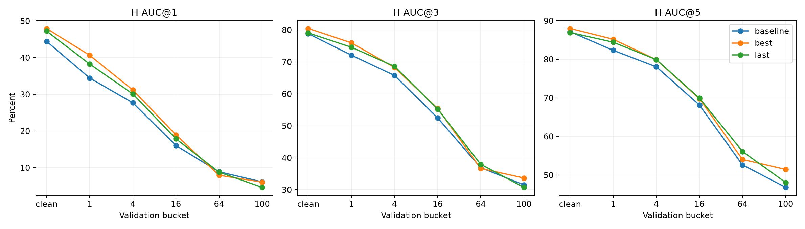
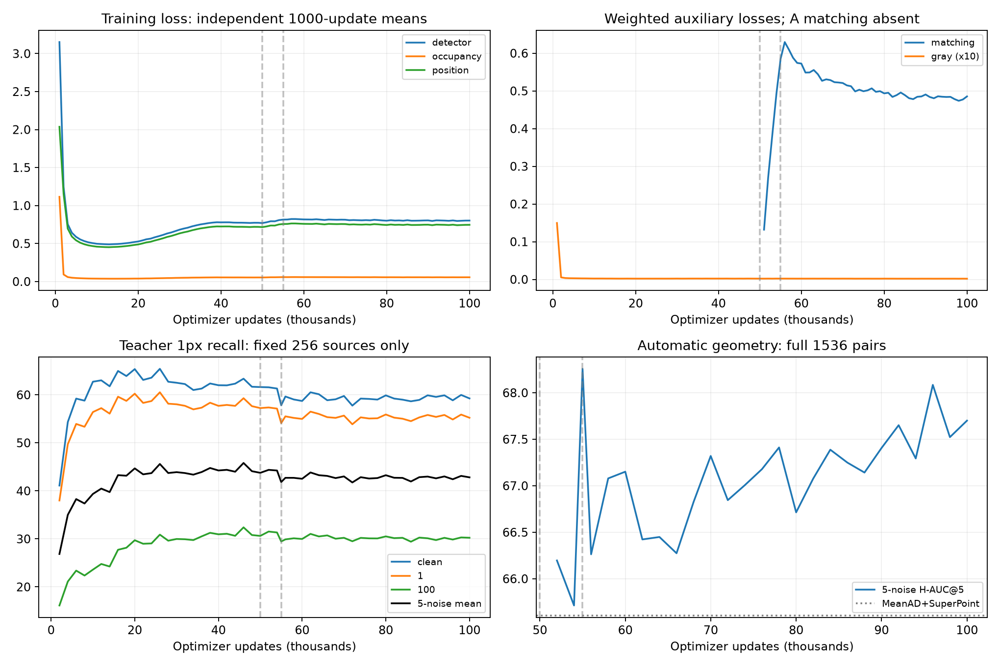
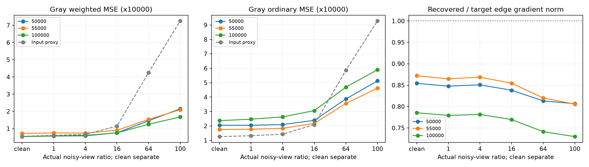

# 100000 更新完整训练分析（2026-10-07）

本次分阶段模型已在固定 COCO 合成 Raw 验证协议上小幅超过 MeanAD+SuperPoint：最终主分数 **67.7004%**，预定规则选出的 C 阶段最佳为 **68.0846%**，基线 **65.6030%**。完整训练把模型推进到了可与基线比较的水平；强噪声精细定位、检测收益在联合阶段的保留、gray 的细节恢复与因果作用仍未闭环。

这是对现有产物的独立复核。本会话新增优化器更新 **0**，没有恢复训练、重跑 GPU 完整验证或改变源码、配置、权重和缓存。原始运行目录为 `outputs/formal_staged_100k_20261002`，完整日志和缓存保留本地。独立统计与审计的首版快照见 [evidence.json](results/v1/evidence.json)，首版权重登记见 [manifest.json](../weights/v1/manifest.json)，原运行的自动分析产物保持不变。

训练完整性核对通过。scalars 和 optimizer journal 各有 100000 条连续、唯一记录，step 为 1…100000，sample_cursor 最终为 1600000。阶段次数为 A50000/B5000/C45000；逐更新学习率、匹配系数、gray10、噪声上限及实际采样范围符合方案，损失记录有限，损失分解与加权求和一致。A 阶段匹配记录为 null，描述子参数和 BN 状态的摘要从初始化到 50000 一致；边界及实际检查点的 Adam 计数也吻合：最终共享/检测/gray 的 80 个参数各更新 100000 次，描述子的 8 个参数各更新 50000 次。

共有两次 KeyboardInterrupt，分别停在 9886、9895；故障记录中成功更新未进入恢复状态的次数均为 0。恢复段为 9886+9+90105，没有重复计数或重启课程。身份变化登记为恢复校验相关的 cli/identity/training 修订，以及同型号 GPU 的可见映射 1→3；模型、loss、数据、噪声、调度和验证数学文件没有在此次迁移中改变。当前源码、7 项已登记资产、训练源清单、验证 manifest 和缓存 identity 均与最终身份吻合。118287 个训练文件名与 256 个验证源文件名无交集。此核对覆盖身份和逐对记录，没有重新推理或逐一重新散列全部缓存张量。

全局裁剪发生 460 次，占 0.46%：A368、B2、C90，没有持续裁剪的现象。更新计时合计约 102.03 小时，记录中的诊断/验证约 4.08 小时；启动到最终检查点的文件修改时间约 **106.83 小时**。后一数字包括中断、绘图和其他间隔，属于依据产物时间戳的运行跨度。

验证采用 `rawfeat.coco.fixed.v2`，256 源、1536 对；clean 单报，五个含噪档 1/4/16/64/100 的 H-AUC@5 等权平均为主分数。基线、最终和所比较检查点的 protocol、manifest、cache identity、source/bucket/ratio 均逐项对齐。H-AUC 是角点几何误差的积分指标，与教师点召回、已知位置描述子检索不同。

| 模型/记录 | 五噪声 H-AUC@5 | 相对基线（百分点） | 地位 |
|---|---:|---:|---|
| MeanAD+SuperPoint | 65.6030% | — | 同身份基线 |
| B 结束，55000 | 68.2572% | +2.6542 | 全部现有几何记录最高；阶段边界参考 |
| C 最佳，96000 | 68.0846% | +2.4816 | best_geometry.pt，按预先规定从 C 阶段选择 |
| 最终，100000 | 67.7004% | +2.0975 | latest.pt，完整预算终点 |

**96000 是 C 阶段最佳，不是全运行记录的最高分。** 55000 的 phase 为 B，不参与预定的 best_geometry 选择；其边界检查点仍保留。这次分析没有事后改变选点规则。

以源图为重采样单位，同一源的五档噪声共同抽样，固定 seed20261007、10000 次配对 bootstrap。最终相对基线主分数的 95% 区间为 **[+0.7876,+3.3881] 个百分点**；C 最佳为 [+1.1310,+3.8562]。这支持当前固定验证协议上的平均收益。最终在 256 源中有 143 个源的五噪声均值提高、111 个降低、2 个持平，并非所有场景都提高。

C 最佳相对最终的 +0.3842 个百分点，区间 [-0.8095,+1.5734]；最终相对 B 结束的 −0.5568 个百分点，区间 [-1.7116,+0.5774]。这些差异不足以确认某一个检查点稳定胜出。区间只度量这些已训练、固定检查点在源图抽样下的差异，不度量不同训练 seed 的波动，不校正反复查看验证集/选最佳的偏差，也不是独立测试集结果。

| 验证桶 | 基线 H-AUC@5 | C 最佳96000 | 最终100000 | 最终−基线（百分点） |
|---|---:|---:|---:|---:|
| clean | 87.1334% | 87.9471% | 86.9108% | −0.2226 |
| 1 | 82.3115% | 85.1784% | 84.4187% | +2.1072 |
| 4 | 78.0584% | 79.8949% | 79.9221% | +1.8636 |
| 16 | 68.1526% | 69.8120% | 69.9363% | +1.7837 |
| 64 | 52.6508% | 54.0624% | 56.1320% | +3.4812 |
| 100 | 46.8415% | 51.4753% | 48.0930% | +1.2516 |

五档最终 H-AUC@5 的点估计都更高，但不能把它解释为五档均已获得独立统计确认：桶1/64的配对区间高于0，桶4/16/100跨0，且这些分桶区间未进行多重比较修正。clean 的微小差异同样跨0。



精细几何和大误差尾部需要分开看。最终 clean H-AUC@1 为47.2101%，高于基线44.4470%，所以不能说 clean 全面更差。最终 ratio100 桶 H-AUC@1/@3 为 **4.6826%/30.7588%**，低于基线 **6.1638%/31.5358%**，即 H-AUC@5 的增益没有转换成全面的高精度优势。该桶角点误差≤1px的对数比例由基线22.66%降至最终15.63%，≤5px则由74.22%升至79.30%。

强噪声下，匹配数量及严重错误尾部有实质变化：ratio100 桶平均正确匹配从115.65增至194.95，匹配精度从58.96%增至64.03%；ratio64从154.51增至229.11。角点误差>20px（含估计失败）的对数在 ratio64 从14降至3、ratio100从20降至8。ratio100 的误差中位数2.336→2.172px、95分位328.83→12.80px。这些观察说明收益包含减少严重错误，不能只用受极端值支配的平均角点误差来描述定位。

最终1536对均返回了单应矩阵，基线有1对估计失败；C 最佳也有1对失败。返回矩阵不代表估计准确，最终仍有8个 ratio100 对的角点误差超过20px。匹配正确性使用3px阈值，条件定位误差只统计已在3px内的邻近点，也不能代替完整误差分布。

阶段学习显示：检测已经学到位置，但后期进入平台；匹配接入带来一部分检测回落。下面仅使用相同的256源诊断，避免把每1000步16源小子集与每2000步完整集交替产生的波动当作模型变化。现有自动图混合了这两种样本量，独立图已经将其分开。

| 更新位置 | 五噪声教师1px召回 | clean 1px/3px召回 | clean cell相位Top1 | 描述子/几何状态 |
|---|---:|---:|---:|---|
| 2000 | 26.86% | 41.11%/68.88% | 23.31% | A，描述子暂停 |
| 20000 | 44.68% | 65.36%/85.24% | 41.15% | A，噪声课程进行中 |
| 46000 | **45.81%** | 63.37%/81.94% | 40.86% | A，best_det |
| 50000 | 43.76% | 61.62%/79.61% | 40.64% | A 结束 |
| 55000 | 41.84% | 57.83%/77.68% | 37.18% | B 结束，主分数68.26% |
| 96000 | 42.42% | 58.86%/77.98% | 38.49% | C 最佳几何 |
| 100000 | 42.82% | 59.26%/78.91% | 38.16% | C 最终 |

训练损失使用独立的1000更新窗口均值。位置损失从最初1000步约2.037降至9001…10000步约0.459，之后随着课程扩展到ratio100回到约0.716（49001…50000）。因此前半程 loss 回升不能简单视为发散或遗忘；训练输入难度在改变。

课程在40000达到完整范围后，49001…50000到54001…55000的检测均值0.770→0.815，其中位置项0.716→0.757。固定协议的召回与相位指标同期回落，这比只看 total loss 更能说明接入期间的检测代价。最终窗口检测约0.802、位置约0.746，未完全恢复A末水平。最终总 loss 约1.290，匹配约0.485；A与B/C的 total 包含不同任务及权重，不能直接跨阶段比较大小。

匹配接入后只训练2000次描述子时，52000的完整主分数已经66.20%；55000为68.26%。后续匹配 loss 从54001…55000的原始均值0.651降至最后1000步0.485，但80000…100000的完整主分数均值约67.38%、范围66.71%…68.08%，后期额外几何收益有限。曲线没有显示持续恶化，也没有证据支持再单纯延长当前训练就会明显突破。



10个B/C梯度探针中，共享层匹配/检测加权梯度范数比的中位数为 S1约2.98、S2约1.94、S3约1.24；检测−匹配余弦的中位数为0.097/0.061/0.027，负值次数分别3/1/2。竞争及方向冲突仍存在，但不是每次都冲突。探针是在成功更新后的模型副本上、用同一批完整累积输入测量的，不是该更新之前的实际梯度；稀疏10批不能直接证明回落全部由梯度竞争导致。

最终已知位置检索为 clean97.72%、ratio100 桶90.16%，按实际ratio100视角为89.41%。描述子已有良好的条件检索能力。它仍依赖已知准确位置及有限候选，实际自动匹配和定位约束仍应以完整几何为准。

当前检测的瓶颈更明确了。最终 clean 正式点均值538.81，教师509.68；实际ratio100视角正式点416.97，教师505.01。原先“普遍响应太低、只能抽出很少点”的外观已明显缓解，但抽点数量接近教师不能说明位置已经正确。

| 最终视角口径 | 正式1px/3px召回 | 无阈值Top1024 1px/3px召回 | cell相位Top1 |
|---|---:|---:|---:|
| clean | 59.26%/78.91% | 63.94%/86.92% | 38.16% |
| 实际ratio64 | 26.86%/47.95% | 29.91%/57.06% | 16.07% |
| 实际ratio100 | **22.10%/42.54%** | **24.93%/52.04%** | **13.48%** |

高噪声验证桶有一半源图是两视角均为该ratio，另一半源图有一个视角为ratio1，因此约25%的视角不是该高ratio。最终ratio100桶的30.24%/50.81%召回不能当作纯ratio100检测能力。按实际ratio分别统计后，提升TopK只能有限增加1px召回，主要补回3px附近的点；精细空间定位及排序仍有缺口。clean的相位Top1也只有38.16%，说明定位问题并不限于强噪声。

前景/背景质量亦未完全拟合：最终clean教师显著cell的质量MAE约0.1410、背景0.00943；实际ratio100约0.2151/0.03218。它们是按cell质量的MAE，不是有点/无点分类错误率。不能用整体质量均值接近教师、背景均值较低，就宣布逐cell判断正确；本次也没有补算cell分类混淆矩阵。

把几何按配对曝光进一步拆开，ratio100下两视角均含高噪声的128源，最终H-AUC@5为43.36%、基线39.23%；一个视角为ratio1的128源，最终52.83%、基线54.46%。对应增益区间均跨0。C 最佳在这两组为46.44%/56.51%。现阶段两侧都需继续检查；单一桶均值掩盖了配对条件和检查点差异。

gray 的定义符合“引导共享部分恢复”的实现：其梯度直接到S1/S2，S3没有直接gray梯度，参数持续更新。共享层加权gray/检测梯度范数比在B/C探针中的中位数约为S1 0.071、S2 0.013。数值权重10不等于它主导共享特征学习；也不能仅凭这些比例就断言必须增大权重。

实际ratio100视角，最终普通MSE为 **0.00058988**，低于输入gray代理 **0.00092843**，下降约36.46%；加权MSE为0.00016747，对比代理0.00072540约下降76.91%。实际ratio64普通MSE也低于代理。高噪声恢复有可观察证据。

但低噪声普通MSE高于代理，且联合后细节指标恶化：

| gray指标 | A末50000 | B末55000 | 最终100000 | 输入代理 |
|---|---:|---:|---:|---:|
| clean普通MSE | 0.00020493 | 0.00017529 | 0.00023672 | 0.00012613 |
| 实际ratio100普通MSE | 0.00051265 | 0.00046234 | 0.00058988 | 0.00092843 |
| 实际ratio100加权MSE | 0.00021510 | 0.00020960 | 0.00016747 | 0.00072540 |
| clean边缘梯度能量比 | 0.8543 | 0.8720 | 0.7855 | — |
| 实际ratio100边缘梯度能量比 | 0.8065 | 0.8057 | 0.7297 | — |

边缘能量比是在clean目标显著边缘上，恢复梯度范数/目标梯度范数。最终方向余弦仍较好（clean0.9249、实际ratio100约0.7994），但幅度偏弱。加权目标偏重暗区，与普通MSE和完整边缘幅度的取向不同，这是解释上述分歧的一条线索；不能单凭它确认具体模糊或幅度偏差的根因。



输入gray代理来自packed通道加权与双线性放大，本身含CFA与插值误差，不能视为严格去噪基线。以上结果支持gray输出学到了部分恢复目标，不能证明这种改善来自共享特征充分降噪，更不能证明gray对检测有因果增益。缺少gray关闭对照，**gray10仍是固定选择，未标定最优**。

对本次训练可作出的判断是：当前mass+正常BN+gray10+分阶段路线能形成有效的完整检测/描述子模型，并在这一固定协议上超过现有基线；长训练确实消除了短训时“尚不足以替代基线”的主分数差距。由于没有同预算100000更新持续联合对照，也没有gray消融，不能把跨过基线归因于分阶段独有优势或gray独有贡献。A50000/B5000/C45000的顺序可行，阶段时长是否经济、最优仍未证明；B末已接近最终，后续45000更新的效果值得单独审视。

后续建议先固定并保留 C 最佳96000、最终100000，以及 B 边界55000作为三个明确候选，完成独立数据/真实低光域验证和部署融合、延迟核对，再决定选哪个作为使用模型。本run中未发现HPatches-raw、MID或部署导出/延迟结果，当前结论限于COCO合成Raw协议。现有记录已经足够进行一轮离线错误样例分析：优先看实际ratio64/100的亚cell错位、TopK仍漏检的教师点、曝光不一致配对和gray边缘幅度不足；下一轮有限对照围绕这些问题设计。当前证据没有给出继续无变化延长训练的充分收益理由。

原始独立分析脚本与复现命令保留在本地planning目录（只读取原run，在独立planning目录写统计与图）；该目录不随首版提交。仓库收录[统计与图快照](results/v1/)和[各候选及基线的1536对记录](results/v1/validation/)，上述bootstrap使用的口径、seed与次数已列明。

```bash
cd /homes/rongjie/projects/RawFeat
OMP_NUM_THREADS=1 MKL_NUM_THREADS=1 /homes/rongjie/software/miniconda3/envs/rawfeat/bin/python \
  .planning/2026-10-07-full-training-analysis/analyze_evidence.py
```

最终运行退出0；审计断言、源图bootstrap及三组PNG/PDF生成通过，已视觉核对。受保护的原scalars/journal/配置/manifest/三检查点/基线及最终/C最佳逐对文件前后SHA相同。本会话没有重跑单元测试，不将历史测试结果计成本轮新测试。
